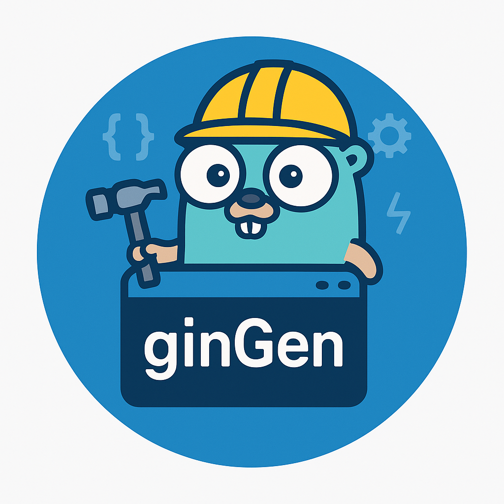
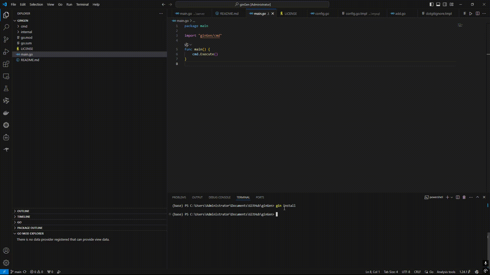

[](https://pkg.go.dev/github.com/leixiaotian1/ginGen/)


# ginGen 🚀

一个极简的Gin框架脚手架工具，快速生成标准项目结构并集成常用组件。




## 特性

- 🛠 一键生成Gin项目基础结构
- 🧩 模块化添加组件（当前支持MySQL）
- 📁 符合Go标准项目布局
- ⚡ 自动依赖管理

## 安装

### 前置要求
- Go 1.24.1+
- Git

### 安装命令
```bash
go install github.com/leixiaotian1/ginGen@latest
```

确保`$GOPATH/bin`已添加到PATH环境变量中

## 使用指南

### 创建新项目
```bash
ginGen new <project_name>
或
ginGen new <project_name> --module <module_path>

# 示例
ginGen new myapp
ginGen new myapp --module github.com/yourname/myapp
```

### 添加功能模块（目前只支持mysql）
```bash
ginGen add <feature>

# 示例（在项目目录内执行）
cd myapp
ginGen add mysql
```


## 项目结构（生成示例）
```
myapp/
├── cmd/
│   └── server/
│       └── main.go
├── configs/
│   └── config.yaml
├── internal/
│   ├── config/
│   │   └── database.go
│   ├── router/
│   │   └── router.go
│   └── repository/
│       └── database.go
├── go.mod
└── go.sum
```

## 支持的功能

### 基础项目
- Gin框架初始化
- 标准路由结构
- 基础配置管理
- 模块化组件设计

### MySQL支持
✅ 添加功能：
- GORM集成
- MySQL驱动配置
- 数据库连接模板
- 自动更新配置文件模板

## 配置说明

添加MySQL后，请编辑`configs/config.yaml`：
```yaml
mysql:
  dsn: "user:password@tcp(localhost:3306)/dbname?charset=utf8mb4&parseTime=True&loc=Local"
```


## 路线图
- [ ] Redis支持
- [ ] 配置文件热加载
- [ ] 日志系统集成
- [ ] 用户自定义模板

## 贡献指南
欢迎提交Issue和PR！请确保：
1. 遵循Go代码规范
2. 添加对应的测试用例
3. 更新相关文档

## 许可证
[MIT License](LICENSE)
