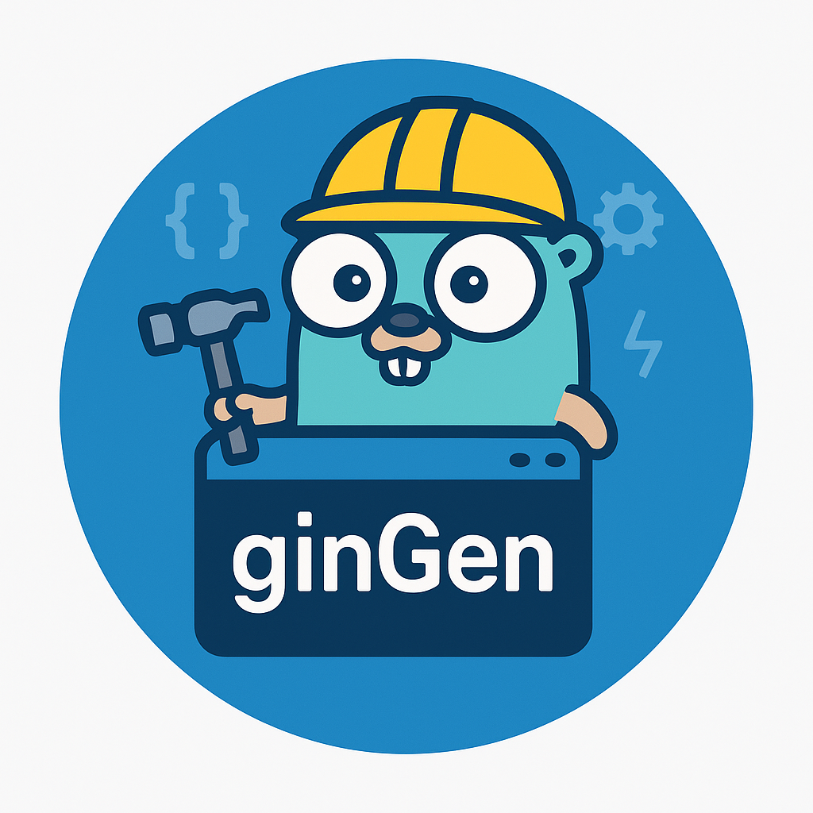
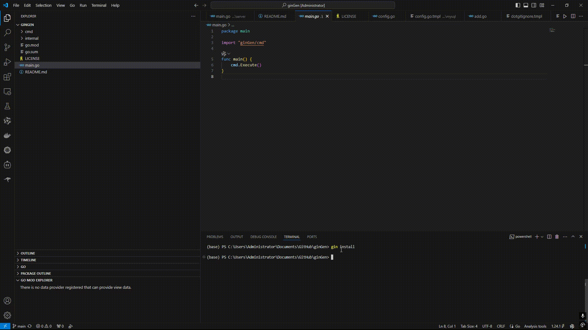

[](https://pkg.go.dev/github.com/leixiaotian1/ginGen/)


# ginGen 🚀

一个极简的Gin框架脚手架工具，快速生成标准项目结构并集成常用组件。




## 特性

- 🛠 一键生成Gin项目基础结构
- 🌐 **Web界面** - 可视化选择模块，类似 Spring Initializr
- 🧩 模块化添加组件（MySQL、PostgreSQL、Redis、Kafka、JWT、日志、Swagger 等）
- 📋 用户级/项目级 `.gingen.yaml` 预设（默认 module、模板覆盖目录）
- 📁 符合Go标准项目布局
- ⚡ 自动依赖管理

## 安装

### 前置要求
- Go 1.24.1+
- Git

### 安装命令
```bash
go install github.com/leixiaotian1/ginGen@latest
```

确保`$GOPATH/bin`已添加到PATH环境变量中

## 使用指南

### 🌐 Web 界面（推荐）

启动 Web 界面，通过可视化方式选择模块并生成项目：

```bash
ginGen web

# 指定端口和主机
ginGen web --port 8080 --host localhost
```

然后在浏览器中打开 `http://localhost:8080`，你可以：
- 输入项目名称和 Go Module 路径
- 勾选需要的功能模块（如 MySQL）
- 一键生成并下载项目 ZIP 包

### 📝 命令行方式

#### 创建新项目
```bash
ginGen new <project_name>
或
ginGen new <project_name> --module <module_path>

# 示例
ginGen new myapp
ginGen new myapp --module github.com/yourname/myapp

# 创建时一次性勾选功能（逗号分隔）
ginGen new myapp --module github.com/yourname/myapp --features mysql,redis,jwt

# 使用 .gingen.yaml 中的 presets.<name>.features
ginGen new myapp --preset api
```

#### 用户配置（`.gingen.yaml`）

可在用户目录或项目根目录放置 `.gingen.yaml`（后者覆盖前者），例如：

```yaml
defaultModule: github.com/yourname/yourapp
templateRoot: /path/to/custom-gingen-templates   # 目录内需包含与内置一致的 templates/... 布局
presets:
  api:
    features: [mysql, redis, jwt]
```

- `defaultModule`：省略 `new --module` 时使用。  
- `templateRoot`：覆盖/扩展嵌入模板（与 `--template-root` 相同语义）。  
- `presets`：为后续扩展保留，可在文档中组合 `add` 使用。

#### 版本与构建信息

```bash
ginGen version
```

发布构建可通过 `-ldflags` 注入版本，参见根目录 `Makefile` 与 `CONTRIBUTING.md`。

#### 添加功能模块
```bash
ginGen add <feature>

# 严格模式（默认）：go get / go mod tidy 失败会退出；可加 --force 仅警告并继续
ginGen add mysql --force

# 使用自定义模板根目录（同 .gingen.yaml 的 templateRoot）
ginGen add swagger --template-root /path/to/templates

# 示例（在项目目录内执行）
cd myapp
ginGen add mysql      # 添加 MySQL/GORM 支持
ginGen add postgres   # 添加 PostgreSQL/GORM 支持
ginGen add redis      # 添加 Redis 缓存支持
ginGen add kafka      # 添加 Kafka 消息队列支持
ginGen add jwt        # 添加 JWT 认证支持
ginGen add logger     # 添加结构化日志支持
ginGen add swagger    # 添加 Swagger 文档支持
ginGen add middleware # 添加常用中间件
ginGen add health     # 添加健康检查端点
ginGen add prometheus # 添加 Prometheus 监控
ginGen add hotreload  # 添加配置热加载
ginGen add cron       # 添加任务调度器
ginGen add upload     # 添加文件上传功能
```


## 项目结构（生成示例）
```
myapp/
├── cmd/
│   └── server/
│       └── main.go
├── configs/
│   └── config.yaml
├── internal/
│   ├── config/
│   │   └── database.go
│   ├── router/
│   │   └── router.go
│   └── repository/
│       └── database.go
├── go.mod
└── go.sum
```

## 支持的功能

### 基础项目
- Gin框架初始化
- 标准路由结构
- 基础配置管理
- 模块化组件设计

### MySQL支持
✅ 添加功能：
- GORM集成
- MySQL驱动配置
- 数据库连接模板
- 自动更新配置文件模板

### Redis支持
✅ 添加功能：
- Redis客户端集成（go-redis/v9）
- 连接池配置
- 超时设置
- 自动更新配置文件模板

### Kafka支持
✅ 添加功能：
- Kafka生产者/消费者客户端（IBM Sarama）
- SASL认证支持
- TLS/SSL支持
- 自动更新配置文件模板

### PostgreSQL支持
✅ 添加功能：
- PostgreSQL数据库支持（GORM）
- 连接池配置
- 自动更新配置文件模板

### JWT认证支持
✅ 添加功能：
- JWT Token生成和验证
- 登录/刷新Token接口
- JWT认证中间件
- 自动更新配置文件模板

### 结构化日志支持
✅ 添加功能：
- Zap结构化日志
- 日志轮转（Lumberjack）
- 请求日志中间件
- 可配置日志级别和格式

### Swagger/OpenAPI文档
✅ 添加功能：
- Swagger UI集成
- API文档自动生成
- 注释生成文档

### 常用中间件
✅ 添加功能：
- CORS跨域支持
- 限流（Rate Limiting）
- Request ID追踪
- 错误恢复（Recovery）

### 健康检查
✅ 添加功能：
- `/health` 健康检查端点
- `/ready` 就绪检查端点
- `/live` 存活检查端点

### Prometheus监控
✅ 添加功能：
- Prometheus指标收集
- `/metrics` 端点
- HTTP请求指标（计数、延迟、大小）

### 配置热加载
✅ 添加功能：
- 配置文件自动监听
- 配置变更自动重载
- 优雅关闭支持

### 任务调度（Cron）
✅ 添加功能：
- Cron任务调度器
- 定时任务支持
- 任务日志记录

### 文件上传
✅ 添加功能：
- 单文件/多文件上传
- 文件类型验证
- 文件大小限制
- 上传进度追踪

## 配置说明

### MySQL配置
添加MySQL后，请编辑`configs/config.yaml`：
```yaml
db:
  mysql:
    dsn: "user:password@tcp(localhost:3306)/dbname?charset=utf8mb4&parseTime=True&loc=Local"
    max_idle_conns: 10
    max_open_conns: 100
    conn_max_lifetime: 3600
```

### Redis配置
添加Redis后，请编辑`configs/config.yaml`：
```yaml
redis:
  addr: "localhost:6379"
  password: ""  # 留空表示无密码
  db: 0
  pool_size: 10
  min_idle_conns: 5
  dial_timeout: 5
  read_timeout: 3
  write_timeout: 3
```

### Kafka配置
添加Kafka后，请编辑`configs/config.yaml`：
```yaml
kafka:
  brokers:
    - "localhost:9092"
  group_id: "my-consumer-group"
  client_id: "gin-app"
  enable_sasl: false
  enable_tls: false
```


## 路线图
- [x] Web 界面支持
- [x] Redis支持
- [x] Kafka支持
- [x] PostgreSQL支持
- [x] JWT 认证支持
- [x] 配置文件热加载
- [x] 日志系统集成
- [x] Swagger文档支持
- [x] 常用中间件集合
- [x] 健康检查端点
- [x] Prometheus监控
- [x] 任务调度器
- [x] 文件上传功能
- [x] 用户自定义模板（`templateRoot` / `--template-root` 覆盖嵌入模板）
- [ ] MongoDB支持
- [ ] RabbitMQ支持

## 贡献指南

详见 [CONTRIBUTING.md](CONTRIBUTING.md)。欢迎提交 Issue 和 PR，请确保：

1. `gofmt`、`go vet ./...`、`go test ./...` 通过（与 CI 一致）
2. 新功能在 `internal/feature` 注册并保持 CLI / Web 行为一致
3. 更新相关文档与 [`docs/BASELINE_REGRESSION.md`](docs/BASELINE_REGRESSION.md)（如有行为变更）

## 许可证
[MIT License](LICENSE)
